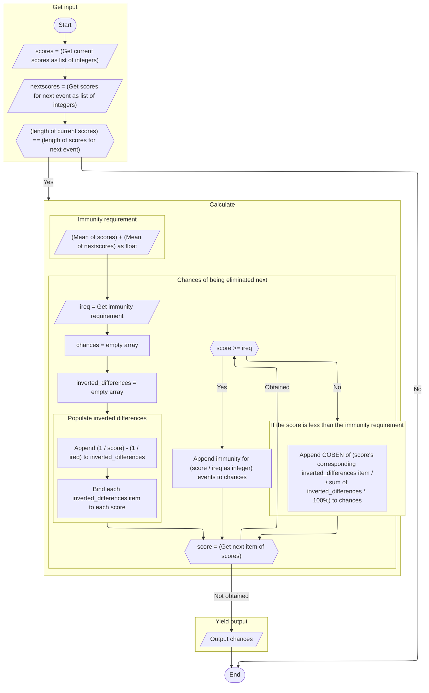

# The COBEN algorithm

**COBEN** stands for ***C**hance **O**f **B**eing **E**liminated **N**ext*.
It determines the relative chance of being eliminated next based on the competitors'
current scores and what scores they can gain after the next event.

<!--
## Description

TODO: Description
-->

## Representation

### Flow chart

